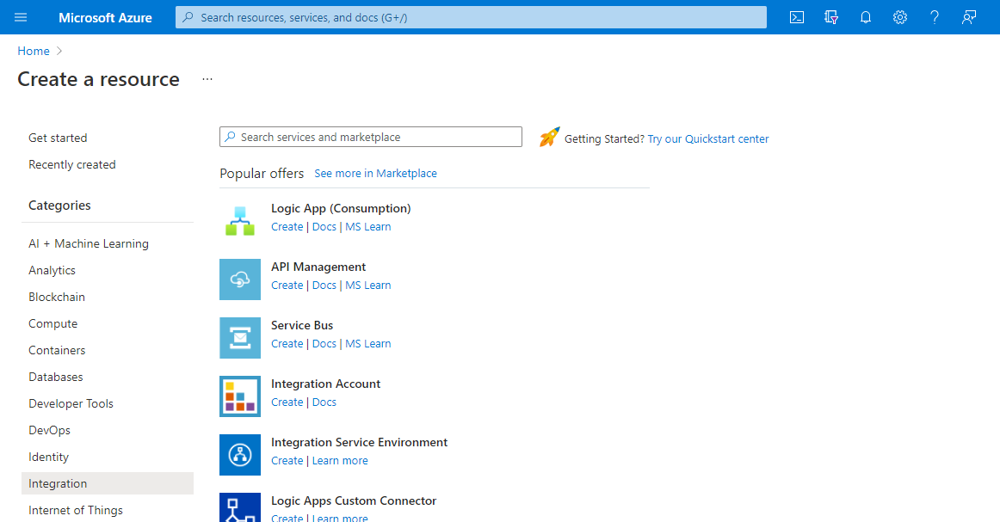

# Create Azure Logic App with ARM Template in Azure Portal

Step 1: Click on <b>Create Resource</b>

Step 2: Navigate to Categories in Left Pane and Click on <b>Integration</b>

Step 3: Select <b>Logic App (Consumption)</b>

Step 4: Create a Logic App

Provide Basic Details

Subscription*: 
	Resource Group*: 
Instance Details:
Logic App Name*:
Region*:

(Optional)
Enable log analytics: Select Check Button
Log Analytics Workspace*: Select a Workspace to Monitor Logic App / else creata if not exits!

Click on <b>Review and Create</b>

Step 5: Click on <b>Download Template for Automation</b>

Step 6: Preview of Logic App Template

Step 7: Click on <b>Download</b> to Save the ARM Template Locally

Step 8: Click on <b>Add to library</b> to Save the ARM Template in Azure

Step 9: Click on <b>Deploy</b> to Deploy the ARM Template in Azure

Step 10: Verify the Deployment in Azure

